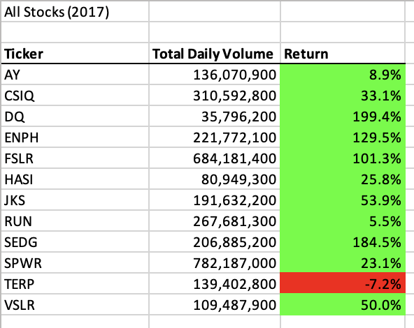
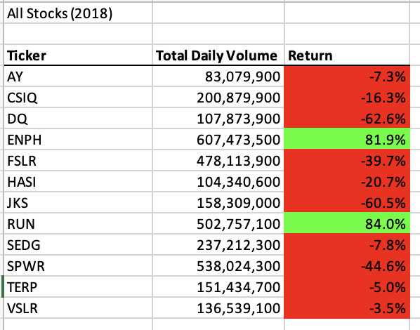
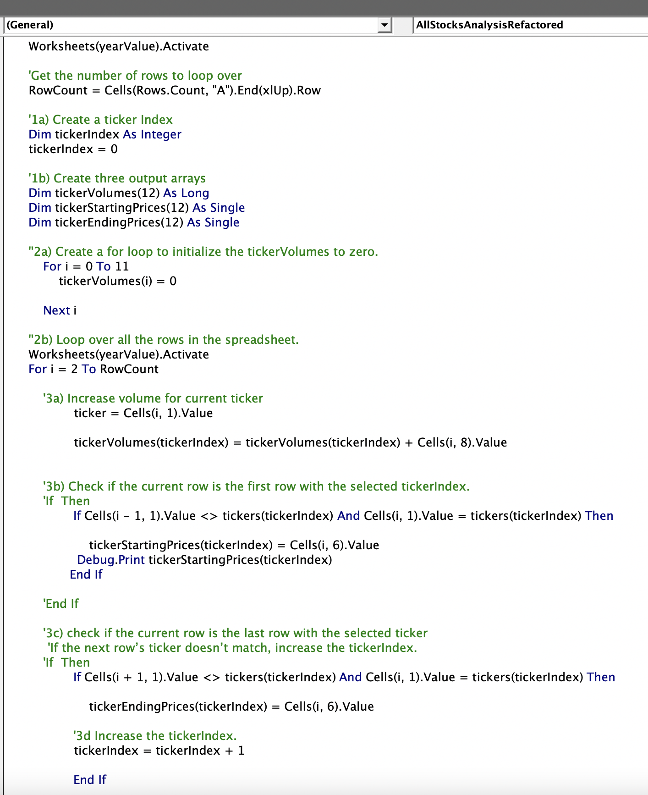
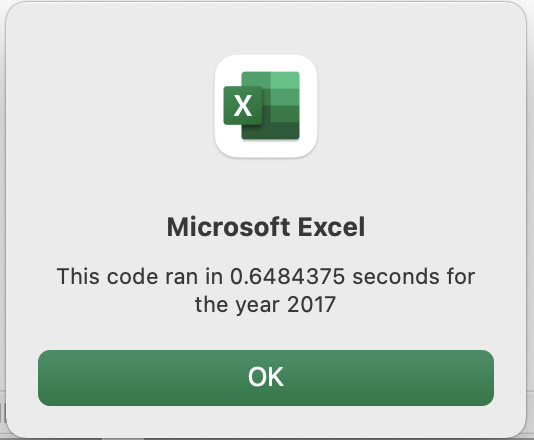
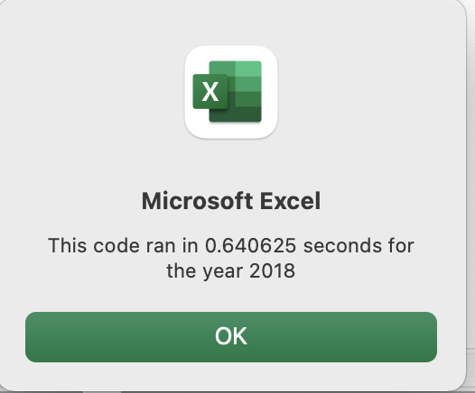
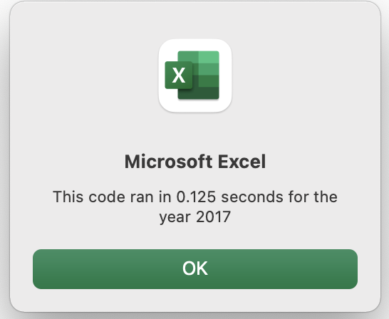
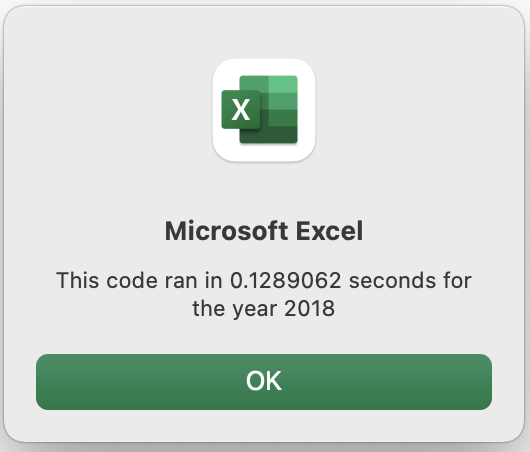

# VBA Challenge

## Overview
The purpose of this analysis was to take the code already written to analyze the 2017 and 2018 performance of a certain group of green energy stocks and refactor it so that it would perform the analysis more efficiently, and thus in less time.

## Results
The performance of the stock of twelve green energy corporations varied a great deal between 2017 and 2018. The original code and the refactored code produced the same result: three columns featuring the twelve companies arranged alphbetically by ticker designation, the total daily volume of each, and the percentage return of each for each year. The annual percentage return was colored green if the return was a positive number, and it was colored red if it was a negative number.
The following screenshots illustrate the 2017 and 2018 output of the original and refactored versions of the code, as the output was exactly the same:

The original code looped through all of the rows of one ticker to get the total volume for the year. Then it got the starting and ending prices of that same ticker, output the data, and moved on to the next ticker.

By means of refactoring, the code becomes more efficient by avoiding some of the looping. The refactored code sends trading volume, starting prices, and ending prices to three arrays, and then needs only to loop through those arrays in order to output the data to the workseet.

Here is an illustration of the pertinent sectionof the refactored code:

The refactored code reduced the run time of the program from about 0.65 and 0.64 seconds for 2017 and 2018, respectively, to 0.13 and 0.13 seconds.
The following are images taken from message boxes that state the run time of the slower original code and the more efficient refactored code:

## Summary
#### What are the advantages or disadvantages of refactoring code?
Refactored code

#### How do these pros and cons apply to refactoring the original VBA script?
